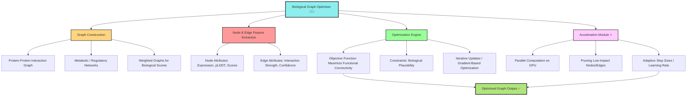

------Under Development------

# **Biological Graph Optimiser** 🧬🔬
 

[](https://doi.org/10.5281/zenodo.15816280)


Welcome to the **Biological Graph Optimiser** project! This tool is designed to optimize biological graphs by improving the quality of interactions, pathways, and networks in biological datasets. Whether you are working with **protein-protein interaction (PPI)** graphs, **gene networks**, or **metabolic pathways**, this tool aims to streamline graph optimization for better analysis, interpretation, and prediction.

---

## **✨ Features:**
- **Graph Optimisation**: Optimise biological networks by refining connections based on certain metrics.
- **GPU Acceleration**-Leverages GPU computing (e.g. CUDA-enabled workflows) to accelerate large-scale graph operations, enabling faster optimisation for high-throughput datasets.
- **FPGA Acceleration (Experimental)**-Supports energy-efficient hardware acceleration using FPGAs for selected graph operations, enabling high performance with low power consumption—particularly useful for large, sparse biological graphs.
- **Visualization**: Visualize biological graphs using cutting-edge plotting techniques.
- **Scalability**: Works with small to large datasets for high-throughput analysis.
- **Easy-to-Use**: Simple and intuitive interface, perfect for both biologists and data scientists.

---

## **📊 How It Works:**

1. **Graph Creation**: Input your biological data (e.g., protein-protein interactions, gene expression).
2. **Optimization Process**: Apply optimization algorithms to improve the graph by refining edges, removing noise, and enhancing meaningful connections.
3. **Output**: Visualize the optimized graph with clearly defined pathways and interactions.

---

## **🛠️ Installation:**

To use the Biological Graph Optimiser, clone the repository and install the dependencies.

```bash
git clone https://github.com/yourusername/biological-graph-optimiser.git
cd biological-graph-optimiser
pip install -r requirements.txt
